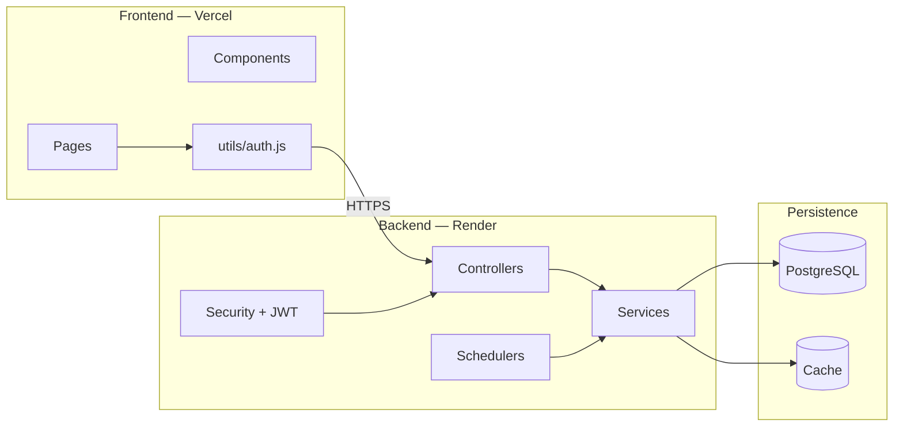
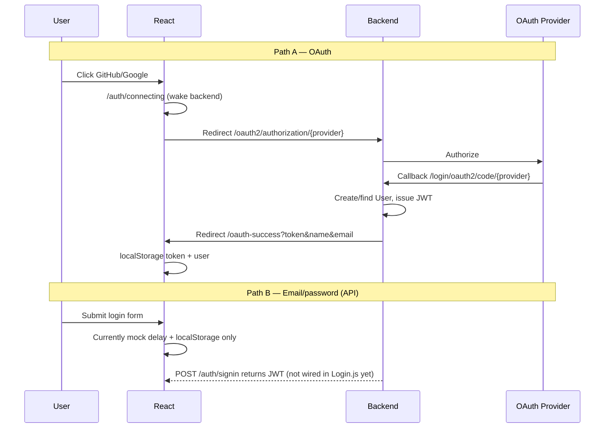
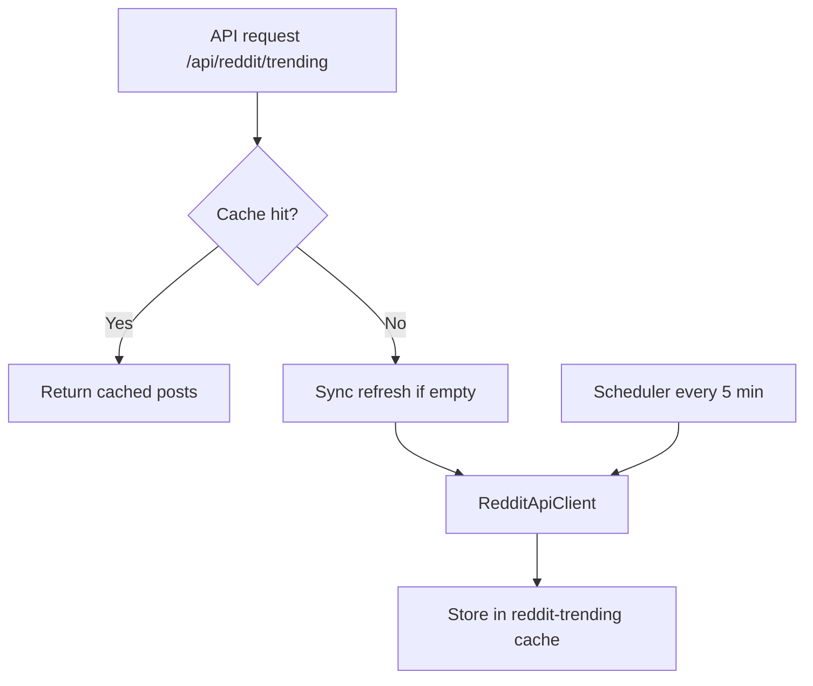

# System Architecture

## High-level view

HiVi is a **three-tier web application**: React SPA → Spring Boot REST API → PostgreSQL, with optional Redis caching and external OAuth/Reddit integrations.



---

## Frontend ↔ Backend communication

| Aspect | Implementation |
|--------|----------------|
| **Base URL** | `REACT_APP_API_URL` or fallback `https://hivi-idam.onrender.com` |
| **Format** | JSON REST |
| **Auth header** | `Authorization: Bearer <token>` (when token exists in localStorage) |
| **CORS** | `WebConfig.java` allows Vercel + localhost |
| **Cookies** | OAuth uses **backend session cookie** on Render domain only; frontend uses **localStorage** |

```text
Browser (hi-vi.vercel.app)
    fetch/axios → hivi-idam.onrender.com/api/...
    window.location → hivi-idam.onrender.com/oauth2/authorization/github  (full redirect)
```

**Important:** OAuth redirects leave the Vercel domain and return via `https://hi-vi.vercel.app/oauth-success?token=...`.

---

## Authentication architecture

Two parallel auth paths:



| Mechanism | Storage | Validation |
|-----------|---------|------------|
| **JWT** | `localStorage.token` | `AuthTokenFilter` on each request |
| **OAuth session** | HTTP session on Render (during redirect) | Spring OAuth2 Client |
| **User profile (UI)** | `localStorage.hivi_user` | Client-side only |

---

## Deployment architecture

```text
┌─────────────────┐     ┌──────────────────────────┐     ┌─────────────────┐
│  Vercel CDN     │     │  Render Web Service     │     │  Render Postgres │
│  React build    │────▶│  Docker + Spring Boot   │────▶│  hivi_db         │
│  hi-vi.vercel   │     │  hivi-idam.onrender.com │     │                  │
└─────────────────┘     └──────────────────────────┘     └─────────────────┘
        │                            │
        │                            ├── Redis (local dev only)
        │                            └── Reddit API (outbound, scheduled)
```

| Environment | Frontend | Backend profile | Cache |
|-------------|----------|-----------------|-------|
| **Local** | `npm start` :3000 | default + optional `local` | Redis |
| **Production** | Vercel | `prod` | In-memory (`simple`) |

---

## External integrations

| Service | Purpose | Config |
|---------|---------|--------|
| **Google OAuth** | Social login | `GOOGLE_CLIENT_ID`, `GOOGLE_CLIENT_SECRET` |
| **GitHub OAuth** | Social login | `GITHUB_CLIENT_ID`, `GITHUB_CLIENT_SECRET` |
| **Reddit** | Trending posts (public JSON) | `reddit.*` in `application.properties` |
| **SMTP** | Email verification (dev) | `spring.mail.*` (localhost:1025) |

---

## Caching architecture



| Cache name | Data | TTL / refresh |
|------------|------|----------------|
| `posts` | All posts list | Evicted on new post; Redis 10m in dev |
| `reddit-trending` | Aggregated Reddit posts | Scheduler + 10m Redis TTL |
| Redis `verify:{email}` | Email verification code | 5 minutes |

---

## Security architecture

```text
Request
  → CorsFilter
  → AuthTokenFilter (JWT if Authorization header present)
  → SecurityFilterChain (authorizeHttpRequests)
  → Controller
```

**Public routes** (no JWT): `/auth/*`, `/posts/*`, `/health`, `/oauth/status`, `/api/reddit/**`, `/oauth2/**`, `/login/**`

**Protected routes** (JWT required): `/feed`, `/user/profile`, `/user/me`, `/videos/**`, `/hello`

---

## Developer understanding

### Why monolith backend (not microservices yet)?

The README mentions microservices as a vision; the **current codebase is a modular monolith** (`controller` → `service` → `repository`). That is appropriate for MVP: one deploy unit, simpler debugging on Render free tier.

### Cross-domain concerns

| Concern | Frontend domain | Backend domain |
|---------|-----------------|----------------|
| OAuth UI | `hi-vi.vercel.app` | `hivi-idam.onrender.com` |
| API calls | Vercel → Render | CORS required |
| OAuth callback | Backend only | Session cookie on Render |

### Failure modes

- **Render cold start** → `wakeBackend.js` pings `/health` before OAuth.
- **Missing `GITHUB_CLIENT_SECRET`** → `/oauth/status` shows `githubClientSecretSet: false`.
- **Reddit rate limit** → Stale cache served; API still responds.

### Production best practices

- Forward headers enabled (`server.forward-headers-strategy=native`) for correct HTTPS URLs behind Render proxy.
- Lazy initialization in prod for faster cold starts.
- Health check path `/health` for Render.
