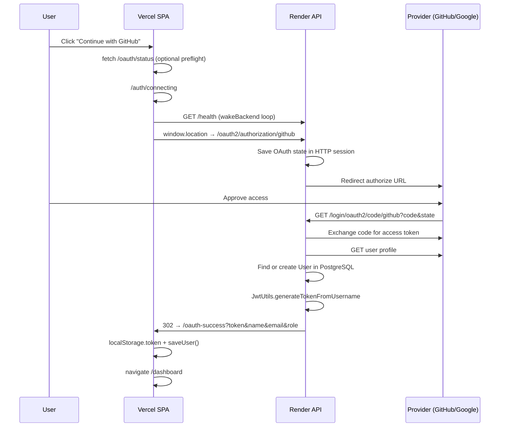

# Authentication Flow

HiVi supports **three authentication mechanisms**:

1. **JWT** — API access after login  
2. **Google OAuth** — Social login  
3. **GitHub OAuth** — Social login  
4. **Email/password** — Backend API (`/auth/signin`); frontend partially wired  

---

## End-to-end OAuth flow (production)



---

## Google OAuth

| Setting | Value |
|---------|--------|
| **Authorization** | `https://accounts.google.com/o/oauth2/v2/auth` (via issuer discovery) |
| **Redirect URI (prod)** | `https://hivi-idam.onrender.com/login/oauth2/code/google` |
| **Scopes** | `openid`, `profile`, `email` |
| **Token method** | `client_secret_post` |
| **Env vars** | `GOOGLE_CLIENT_ID`, `GOOGLE_CLIENT_SECRET` |

**Google Cloud Console:** Credentials → OAuth 2.0 Client → Authorized redirect URIs must match exactly.

---

## GitHub OAuth

| Setting | Value |
|---------|--------|
| **Authorization** | `https://github.com/login/oauth/authorize` |
| **Redirect URI (prod)** | `https://hivi-idam.onrender.com/login/oauth2/code/github` |
| **Scopes** | `read:user`, `user:email` |
| **Token method** | `client_secret_post` |
| **Env vars** | `GITHUB_CLIENT_ID`, `GITHUB_CLIENT_SECRET` |

**GitHub Developer Settings:** OAuth App → Authorization callback URL (exact match).

**Email handling:** If public email is hidden, `CustomOAuth2UserService` calls `https://api.github.com/user/emails`.

---

## JWT authentication

### Generation

| Trigger | Code |
|---------|------|
| `POST /auth/signin` | `JwtUtils.generateJwtToken(authentication)` |
| OAuth success | `JwtUtils.generateTokenFromUsername(email)` |

### Structure

- Algorithm: **HS256**
- Secret: `JWT_SECRET` env (plain text hashed with SHA-256 if not valid Base64)
- Expiry: `spring.app.jwtExpirationMs` (default 86400000 ms = 24h)
- Subject: username (email for OAuth users)

### Validation

`AuthTokenFilter` on every request (except skipped paths):

```text
Authorization: Bearer <token>
  → validateJwtToken
  → loadUserByUsername
  → SecurityContextHolder.setAuthentication
```

### Skipped paths (no JWT required)

`/auth`, `/user/signup`, `/user/signin`, `/oauth2`, `/login`, `/health`, `/oauth/status`, `/api/reddit`, `/actuator`

---

## Login flow comparison

| Step | Email (UI today) | Email (API) | OAuth |
|------|------------------|-------------|-------|
| User input | Login form | Login form | Provider button |
| Backend call | None (mock) | `POST /auth/signin` | Redirect chain |
| Token stored | Optional | `localStorage.token` | URL param → localStorage |
| User stored | `saveUser()` | Should map response | `saveUser()` from query params |
| Redirect | `/dashboard` | `/dashboard` | `/oauth-success` → `/dashboard` |

---

## Token storage (frontend)

| Key | Content |
|-----|---------|
| `localStorage.token` | JWT string |
| `localStorage.hivi_user` | `{ name, email, role, provider, projects }` |

**Security note:** localStorage is vulnerable to XSS. For production hardening, consider httpOnly cookies + CSRF strategy later.

---

## OAuth failure flow

```text
OAuth error on backend
  → OAuth2LoginFailureHandler
  → Map to short code: invalid_client | session_expired | oauth_failed | ...
  → Redirect https://hi-vi.vercel.app/login?error={code}
  → Login.js → parseOAuthError() → OAuthErrorCard
```

**Diagnostics:** `GET https://hivi-idam.onrender.com/oauth/status`

Check `githubClientSecretSet`, `readyForGithubLogin`, `issues[]`.

---

## CORS flow

`WebConfig.java`:

```java
allowedOriginPatterns(
  "http://localhost:3000",
  "http://localhost:5173",
  frontendUrl,  // APP_FRONTEND_URL
  "https://hi-vi.vercel.app",
  "https://*.vercel.app"
)
allowCredentials(true)
```

Browser on Vercel calls Render API with `fetch` / axios — preflight `OPTIONS` handled by Spring CORS.

**OAuth redirects** are full-page navigation (not CORS XHR).

---

## Session vs JWT

| Concern | Mechanism | Domain |
|---------|-----------|--------|
| OAuth state during redirect | HTTP session (`JSESSIONID`) | `hivi-idam.onrender.com` |
| API calls after login | JWT Bearer | Cross-origin from Vercel |

---

## Environment variables (auth)

| Variable | Required | Purpose |
|----------|----------|---------|
| `JWT_SECRET` | Yes | Sign JWTs |
| `APP_FRONTEND_URL` | Yes (prod) | OAuth success/failure redirects |
| `GOOGLE_CLIENT_ID` | For Google | OAuth client |
| `GOOGLE_CLIENT_SECRET` | For Google | OAuth secret |
| `GITHUB_CLIENT_ID` | For GitHub | OAuth client |
| `GITHUB_CLIENT_SECRET` | For GitHub | **Required** for GitHub login |
| `RENDER_EXTERNAL_URL` | Auto on Render | OAuth redirect base URL |

---

## Developer understanding

### Why OAuth fails with `invalid_client` on GitHub

Almost always **`GITHUB_CLIENT_SECRET` missing or wrong** on Render. Confirm via `/oauth/status`.

### Why `client_secret_post`?

GitHub’s token endpoint expects credentials in the POST body; Spring default Basic auth can fail.

### Alternatives

| Approach | Tradeoff |
|----------|----------|
| Auth0 / Firebase Auth | Less code, monthly cost |
| PKCE-only SPA | No client secret in backend, more frontend complexity |
| Cookie sessions for API | Simpler XSS model, harder cross-domain Vercel↔Render |

### Production best practices

- Rotate OAuth secrets if exposed
- Never commit secrets; use Render/Vercel env UI
- Use `/oauth/status` after every deploy
- Complete OAuth quickly after cold start (session timeout 15m in prod)

### Files to edit for auth changes

| Change | File(s) |
|--------|---------|
| Public routes | `SecurityConfig.java`, `AuthTokenFilter.java` |
| OAuth redirect URL | `application-prod.properties`, `OAuth2LoginSuccessHandler.java` |
| Frontend error messages | `oauthErrors.js`, `OAuthErrorCard.js` |
| Wake before OAuth | `wakeBackend.js`, `AuthConnecting.js` |
