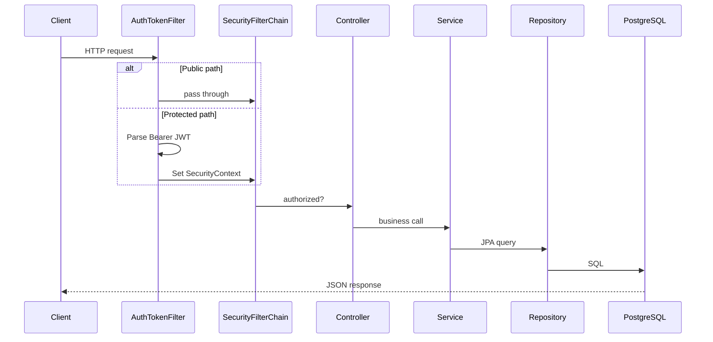

# Backend Flow

**Base package:** `com.oauth.demo`  
**Entry point:** `DemoApplication.java` (`@EnableScheduling` for Reddit refresh)

---

## Layered structure

```text
Request
  └── security/          (filters, OAuth handlers, SecurityConfig)
  └── controller/        (REST endpoints)
  └── reddit/controller/ (Reddit API)
  └── service/           (business logic)
  └── reddit/service/    (Reddit fetch + trending)
  └── repository/        (JPA data access)
  └── entity/            (database tables)
  └── dto/               (API request/response shapes)
  └── config/            (beans: DB, cache, OAuth, startup)
  └── jwt/               (token create/validate)
```

---

## Request lifecycle



---

## Controllers

| Class | Base path | Role |
|-------|-----------|------|
| `AuthController` | `/auth` | Signup, signin, email verify |
| `UserController` | `/user` | Profile, `/me` |
| `PostController` | `/posts` | Create/list posts |
| `FeedController` | `/feed` | Authenticated feed (same as posts today) |
| `VideoController` | `/videos` | Upload/list videos |
| `HealthController` | `/health` | Render health check |
| `OAuthStatusController` | `/oauth/status` | Deploy diagnostics |
| `LoginRedirectController` | `/login` | Redirect OAuth errors to frontend |
| `HelloController` | `/hello` | Smoke test |
| `RedditController` | `/api/reddit` | Trending Reddit posts |

---

## Services

| Service | Responsibility |
|---------|----------------|
| `UserService` | Registration, password encoding, verification codes in Redis |
| `CustomUserDetailsService` | Load user for JWT validation |
| `PostService` | Create post, list with `@Cacheable("posts")` |
| `VideoService` | Video metadata |
| `EmailService` | Send verification email |
| `RedditApiClient` | HTTP calls to Reddit `.json` endpoints |
| `RedditTrendingService` | Cache, filter, paginate trending posts |
| `RedditCacheService` | Read/write `reddit-trending` cache |

---

## Repositories (JPA)

| Repository | Entity | Key methods |
|------------|--------|-------------|
| `UserRepository` | `User` | `findByUsername`, `findByEmail` |
| `PostRepository` | `Post` | `findAll`, `findAllByOrderByCreatedAtDesc` |
| `VideoRepository` | `Video` | Standard JPA |

---

## DTOs vs entities

| Type | Purpose | Example |
|------|---------|---------|
| **Entity** | Database row | `User`, `Post`, `Video` |
| **DTO** | API contract | `LoginRequest`, `LoginResponse` |
| **Record DTO** | Reddit API | `RedditPostDto`, `RedditTrendingResponse` |
| **SignupRequest** | Signup payload | `payload/request/SignupRequest.java` |

Entities should not leak directly to frontend without a stable contract (today some controllers return entities directly).

---

## Security components

| File | Role |
|------|------|
| `SecurityConfig` | Filter chain, permit rules, OAuth2 login |
| `AuthTokenFilter` | JWT extraction + `SecurityContext` |
| `AuthEntryPointJwt` | 401 JSON for unauthorized API calls |
| `OAuth2LoginSuccessHandler` | Save user, JWT, redirect to frontend |
| `OAuth2LoginFailureHandler` | Map error → redirect `/login?error=code` |
| `CustomOAuth2UserService` | GitHub email resolution |
| `OAuth2ClientConfig` | `HttpSessionOAuth2AuthorizationRequestRepository` |

---

## JWT flow

```text
Sign-in or OAuth success
  → JwtUtils.generateTokenFromUsername(email)
  → HS256 signed token (secret from JWT_SECRET, SHA-256 derived if plain text)

Subsequent requests
  → AuthTokenFilter reads Authorization: Bearer ...
  → JwtUtils.validateJwtToken + getUserNameFromJwtToken
  → CustomUserDetailsService.loadUserByUsername
```

**File:** `jwt/JwtUtils.java`

---

## Redis usage

| Use case | Key pattern | Profile |
|----------|-------------|---------|
| Spring Cache `posts` | cache abstraction | Redis local / memory prod |
| Spring Cache `reddit-trending` | cache abstraction | Redis local / memory prod |
| Email verification | `verify:{email}` | Redis only (optional bean) |

`CacheConfig.java` creates Redis cache manager when `spring.cache.type=redis`.

**Production (`application-prod.properties`):** Redis auto-config **disabled**; `spring.cache.type=simple`.

---

## Schedulers

| Class | Trigger | Action |
|-------|---------|--------|
| `RedditRefreshScheduler` | `ApplicationReadyEvent` + `@Scheduled` every 5 min | `RedditTrendingService.refreshCache()` |

Scheduler fetches Reddit; **user API requests do not call Reddit** (rate-limit safe).

---

## OAuth (backend side)

```text
GET /oauth2/authorization/{registrationId}
  → Spring stores authorization request in HTTP session
  → Redirect to Google/GitHub

GET /login/oauth2/code/{registrationId}?code=...&state=...
  → Exchange code for token
  → Load user info (CustomOAuth2UserService for GitHub)
  → OAuth2LoginSuccessHandler
  → Redirect https://hi-vi.vercel.app/oauth-success?token=...
```

**Redirect URIs (prod):**

- `https://hivi-idam.onrender.com/login/oauth2/code/google`
- `https://hivi-idam.onrender.com/login/oauth2/code/github`

---

## Database configuration

`DatabaseConfig.java` builds DataSource from:

1. `DATABASE_URL` (Render format `postgresql://...`)
2. Or `DB_HOST`, `DB_USERNAME`, `DB_PASSWORD`

`DatabaseUrlParser.java` normalizes URLs for HikariCP.

---

## Configuration files

| File | When active |
|------|-------------|
| `application.properties` | Default / local |
| `application-local.properties` | Profile `local` |
| `application-prod.properties` | Profile `prod` on Render |

---

## Developer understanding

### Why controller → service → repository?

Clear separation for testing and future splits. Controllers stay thin; caching and Reddit logic stay in services.

### Why session for OAuth but JWT for API?

OAuth2 authorization code flow **requires** server-side state between redirects. JWT keeps subsequent API calls stateless.

### Alternatives

| Topic | Alternative |
|-------|-------------|
| Reddit | Official OAuth API + higher rate limits |
| Cache | Always Redis via Render Key Value |
| Auth | Session cookies for API instead of JWT |

### Request path cheat sheet

| You want to change… | Start here |
|---------------------|------------|
| Who can access an endpoint | `SecurityConfig.java` |
| JWT behavior | `JwtUtils.java`, `AuthTokenFilter.java` |
| OAuth redirect after login | `OAuth2LoginSuccessHandler.java` |
| Reddit post fields | `RedditApiClient.java`, `RedditPostDto.java` |
| DB connection on Render | `DatabaseConfig.java`, env `DATABASE_URL` |
