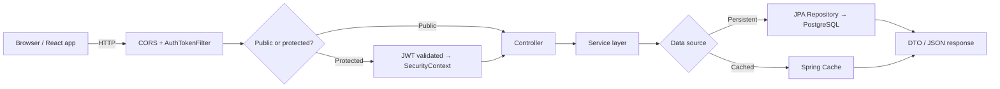
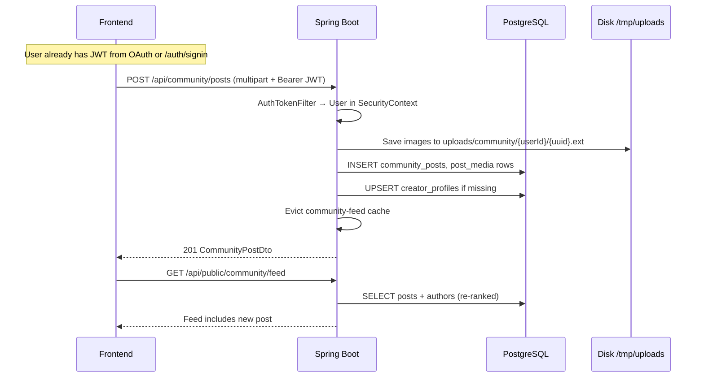
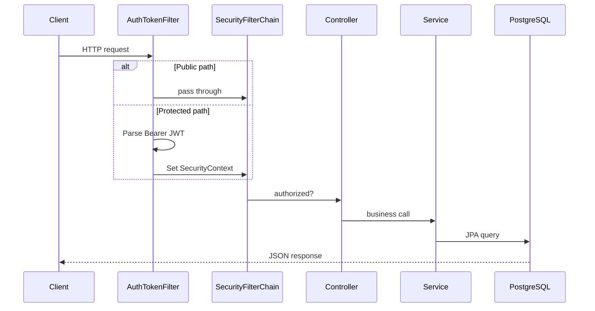
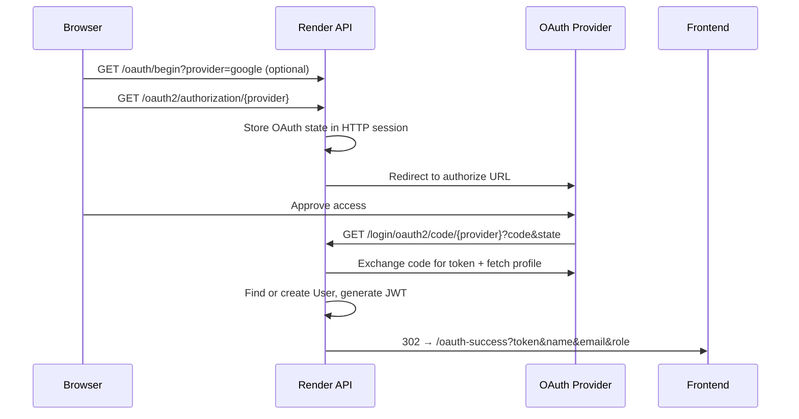
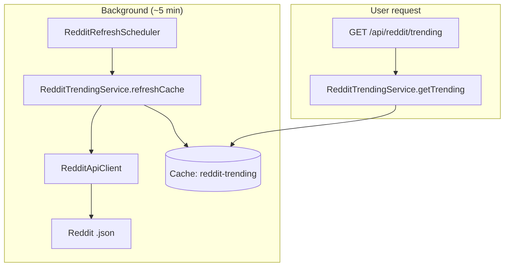
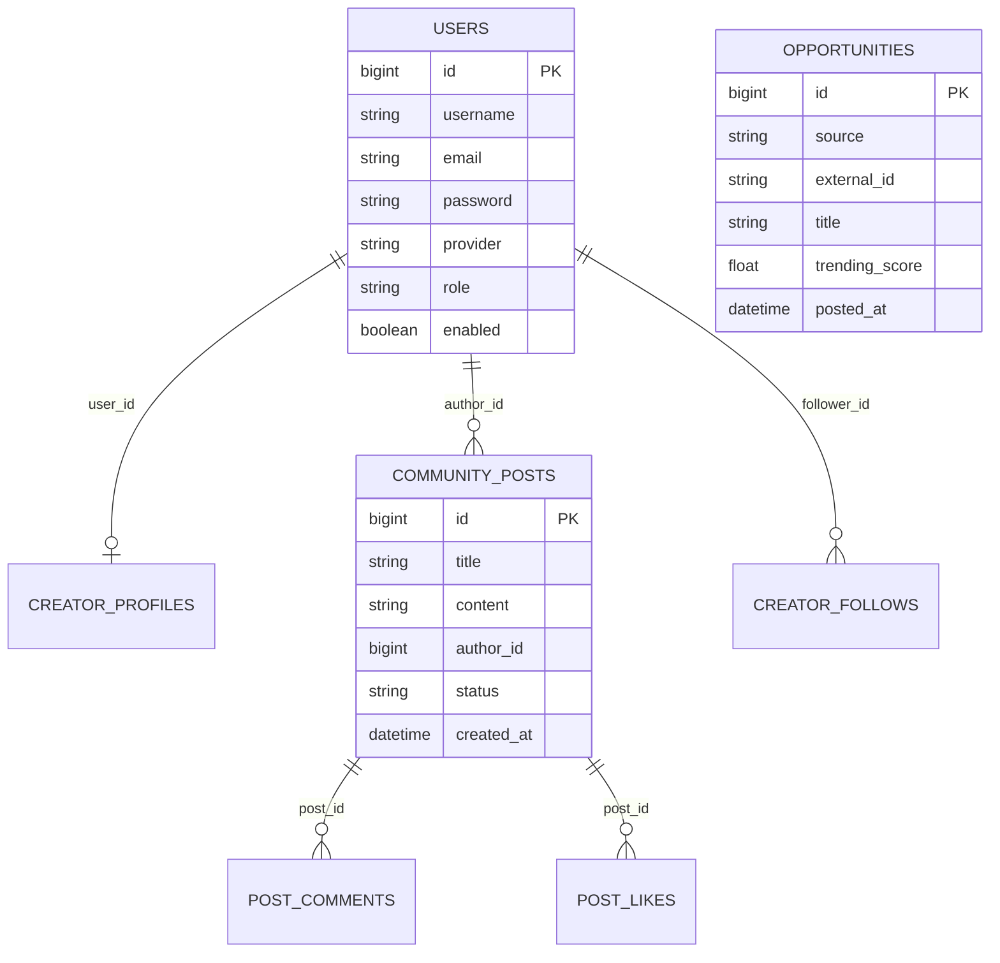

# HiVi Backend Flow

Single reference for the Spring Boot API: architecture, auth, endpoints, data model, feature modules, and deployment.

**Start here:** [End-to-end walkthrough](#end-to-end-walkthrough) — how requests flow, how APIs are called, and why each schema table exists.

**Base package:** `com.oauth.demo`  
**Entry point:** `DemoApplication.java` (`@EnableScheduling`)  
**Production API:** `https://hivi-idam.onrender.com`

---

## End-to-end walkthrough

This section explains how the backend works as a whole: what happens when the app starts, how a client call travels through the stack, which tables exist and why, and how background jobs feed the APIs.

### 1. Application startup

When `DemoApplication` starts on Render (or locally), Spring Boot wires together four layers:

```text
Config (DB, cache, OAuth, CORS)
    → Security filter chain (JWT + OAuth2)
    → REST controllers
    → Services + JPA repositories
    → PostgreSQL (tables auto-created/updated via Hibernate ddl-auto=update)
```

On first boot with an empty database:

| Bootstrap | Trigger | What it creates |
|-----------|---------|-----------------|
| `CommunityEmptyBootstrapRunner` | `community.bootstrap.on-empty=true` and no posts | Demo creator personas + sample community posts |
| `OpportunityIngestionService.ensureSeeded()` | First `GET /api/opportunities*` | Loads `curated-opportunities.json` if table is empty |
| `RedditRefreshScheduler` | `@Scheduled` + startup hook | Fetches Reddit `.json`, fills `reddit-trending` cache |

Schedulers also start immediately: Reddit refreshes every ~5 minutes; opportunities refresh every 15 minutes (configurable). These run **in the background** — user HTTP requests never call Reddit or external job boards directly.

### 2. How every API call flows

Regardless of endpoint, the path is the same:



**Concrete example — public community feed:**

```text
GET /api/public/community/feed?mode=trending&page=0&size=15
  → SecurityConfig permits /api/public/** (no JWT)
  → PublicCommunityController.getFeed()
  → CommunityPostService.getFeed()
       → reads community_posts (+ author join) from PostgreSQL
       → CommunityFeedRanker scores each post
       → result cached under community-feed
  → CommunityFeedResponse JSON
```

**Concrete example — authenticated like:**

```text
POST /api/community/posts/42/like
  Header: Authorization: Bearer <JWT>
  → AuthTokenFilter parses JWT, loads User via CustomUserDetailsService
  → SecurityConfig requires authentication for POST /api/community/**
  → CommunityController.likePost()
  → CommunityInteractionService.toggleLike()
       → INSERT or DELETE in post_likes (unique per user+post)
       → UPDATE likeCount on community_posts
       → evict community-feed cache
  → 200 JSON { liked: true, likeCount: 17 }
```

The pattern `controller → service → repository → entity` is used everywhere. Controllers only map HTTP to service calls and return DTOs; they do not contain business logic.

### 3. Authentication: how the client gets a JWT

The frontend (`https://hi-vi.vercel.app`) talks to the API cross-origin. Two login paths both end with a JWT the client stores and sends on protected routes.

#### Path A — email/password

```text
POST /auth/signup   → creates users row (provider=LOCAL, role=client); auto-enabled in prod (no Redis); email verification only when Redis is available (local)
POST /auth/signin   → validates password by username or email → returns JWT in JSON body
```

JWT subject = username (email). Subsequent calls send `Authorization: Bearer <token>`.

#### Path B — OAuth (Google / GitHub)

OAuth is a **browser redirect chain** on the API domain, not a JSON API:

```text
1. User clicks "Sign in with Google"
2. Frontend → GET https://hivi-idam.onrender.com/oauth2/authorization/google
3. Backend stores OAuth state in HTTP session (JSESSIONID cookie on Render domain)
4. Backend redirects to Google → user approves
5. Google → GET /login/oauth2/code/google?code=...
6. OAuth2LoginSuccessHandler:
     - exchanges code for profile
     - finds or creates users row (provider=GOOGLE or GITHUB)
     - issues JWT
7. 302 redirect → https://hi-vi.vercel.app/oauth-success?token=...&name=...&email=...
8. Frontend saves token; all later API calls use Bearer JWT (stateless, no session cookie)
```

**Why two mechanisms?** OAuth redirect requires server-side session to hold `state` between hops. Day-to-day API usage is stateless JWT so the SPA on Vercel does not need cookies on every request.

### 4. Feature domains and their API ↔ data paths

#### Community (primary social product)

| Client action | API | DB tables touched | Why those tables exist |
|---------------|-----|-------------------|------------------------|
| Browse feed (no login) | `GET /api/public/community/feed` | `community_posts`, `users`, `creator_profiles` | Posts hold content; users are authors; profiles add bio/niche for creator UX |
| View post + comments | `GET /api/public/community/posts/{id}` | `community_posts`, `post_comments` | Comments are normalized — many per post, supports replies |
| Like / bookmark | `POST /api/community/posts/{id}/like` | `post_likes`, `post_bookmarks` | Junction tables enforce one like/bookmark per user per post |
| Create post | `POST /api/community/posts` (multipart) | `community_posts`, `post_media` | Media gallery stored separately; files on disk (`uploads/community/`) |
| Follow creator | `POST /api/community/users/{id}/follow` | `creator_follows` | Directed graph: follower_id → following_id |
| Repost | `POST /api/community/posts/{id}/repost` | `community_posts` (new row, `original_post_id` FK) | Repost is a new post pointing at source; `repostCount` denormalized for speed |

Public reads use `/api/public/community/*` so the feed works even when JWT config is wrong. Writes always require JWT on `/api/community/*`.

#### Opportunities (hiring / gigs)

| Client action | API | DB / cache | Why |
|---------------|-----|------------|-----|
| Browse jobs | `GET /api/opportunities` | `opportunities` table + `opportunities-feed` cache | Single table for Reddit, curated, and user-submitted gigs |
| Trending strip | `GET /api/opportunities/trending` | `opportunities` ordered by `trending_score` | Score precomputed on ingest by `OpportunityRanker` |
| Post a gig | `POST /api/opportunities` (JWT) | `opportunities` (`source=USER`, `posted_by_user_id` FK) | Links user-posted gigs to `users` |

**Background ingestion** (not triggered by user clicks):

```text
OpportunityRefreshScheduler (every 15 min)
  → RedditOpportunityFetcher: Reddit .json → RedditHiringDetector filters hiring posts
  → CuratedOpportunityProvider: reads curated-opportunities.json (Internshala, LinkedIn URLs)
  → OpportunityIngestionService.upsert(source, externalId)
       → unique index on (source, externalId) prevents duplicates
       → CompanyLogoResolver sets logoUrl at ingest time
  → evict opportunities-feed + opportunities-trending caches
```

The `opportunities` table stores normalized job cards. External sources are identified by `(source, externalId)` so re-ingestion updates the same row instead of duplicating.

#### Reddit trending (read-only, cache-only)

| Client action | API | Storage | Why not in PostgreSQL |
|---------------|-----|---------|----------------------|
| Trending posts widget | `GET /api/reddit/trending` | Spring cache `reddit-trending` | Ephemeral third-party data; refreshed on schedule; no user writes |

```text
RedditRefreshScheduler (~5 min)
  → RedditApiClient fetches subreddit .json endpoints
  → RedditTrendingService aggregates, sorts, stores in cache
  → on cloud IP block: RedditFallbackPosts supplies curated fallback

User GET /api/reddit/trending
  → RedditTrendingService.getTrending() reads cache only
  → never hits Reddit at request time (rate limits + latency)
```

#### Legacy modules (still present, lower traffic)

| Module | API | Table | Purpose |
|--------|-----|-------|---------|
| Legacy posts | `GET/POST /posts`, `GET /feed` | `post` | Early prototype feed; `@Cacheable("posts")` |
| Videos | `GET/POST /videos/**` | `videos` | Upload scaffold for future video features |
| Users | `GET /user/profile`, `/user/me` | `users` | Profile reads for authenticated shell |

### 5. Database schema — what exists and why

Hibernate creates/updates tables from `@Entity` classes (`ddl-auto=update`). No Flyway migrations yet.

```mermaid
erDiagram
    USERS ||--o| CREATOR_PROFILES : "1:1 bio and stats"
    USERS ||--o{ COMMUNITY_POSTS : author
    USERS ||--o{ POST_LIKES : liker
    USERS ||--o{ POST_BOOKMARKS : saver
    USERS ||--o{ CREATOR_FOLLOWS : follower
    USERS ||--o{ OPPORTUNITIES : "posted_by (USER source)"
    COMMUNITY_POSTS ||--o{ POST_COMMENTS : comments
    COMMUNITY_POSTS ||--o{ POST_LIKES : likes
    COMMUNITY_POSTS ||--o{ POST_MEDIA : gallery
    COMMUNITY_POSTS ||--o| COMMUNITY_POSTS : repost_of

    USERS {
        bigint id PK
        string email "JWT subject"
        string provider "LOCAL GOOGLE GITHUB"
        string role
        boolean enabled
    }

    CREATOR_PROFILES {
        bigint id PK
        bigint user_id FK UK
        string bio
        string niche
        int follower_count
    }

    COMMUNITY_POSTS {
        bigint id PK
        bigint author_id FK
        string title
        string status "DRAFT PUBLISHED"
        int likeCount "denormalized"
        bigint original_post_id FK "reposts"
    }

    OPPORTUNITIES {
        bigint id PK
        string source "REDDIT CURATED USER"
        string external_id UK_with_source
        float trending_score
        string logoUrl "resolved at ingest"
    }
```

| Table | Created because… |
|-------|------------------|
| `users` | Single identity store for local signup, OAuth, JWT subject, and FK target for posts/opportunities |
| `creator_profiles` | Separates public creator persona (bio, niche, follower stats) from auth fields in `users` |
| `community_posts` | Core content unit for the social feed; status supports drafts; denormalized counts avoid expensive aggregates on read |
| `post_comments` | Threaded discussion; indexed by `post_id` for fast comment loads |
| `post_likes` / `post_bookmarks` | Unique (user, post) pairs — toggling is insert/delete, not counter corruption |
| `post_media` | Multi-image posts; `mediaUrl` on post kept for backward compatibility |
| `creator_follows` | Social graph; unique (follower, following) prevents duplicate follows |
| `opportunities` | Unified job/gig store across ingestion sources; `(source, externalId)` unique index enables idempotent upsert |
| `post` (legacy) | Original `/posts` endpoint before community module |
| `videos` | Placeholder for authenticated video upload feature |

**Not in PostgreSQL:** Reddit trending payloads live only in the `reddit-trending` cache entry.

### 6. Caching strategy (why responses are fast)

| Cache | Populated by | Invalidated when | Serves |
|-------|--------------|------------------|--------|
| `community-feed` | First feed request per page/mode | Any community write (post, like, comment) | `GET /api/public/community/feed` |
| `opportunities-feed` | First list request | Opportunity scheduler upsert | `GET /api/opportunities` |
| `opportunities-trending` | Scheduler + first trending request | Opportunity scheduler upsert | `GET /api/opportunities/trending` |
| `reddit-trending` | `RedditRefreshScheduler` only | Overwritten each refresh | `GET /api/reddit/trending` |
| `posts` | `GET /posts` | New legacy post | `GET /posts`, `GET /feed` |

Production uses in-memory cache (`spring.cache.type=simple`). Local dev can use Redis for email verification codes (`verify:{email}`).

### 7. Full request journey (authenticated community post)

End-to-end example tying auth, API, schema, cache, and storage:



### 8. How sections below map to this walkthrough

| Topic below | Relates to walkthrough step |
|-------------|----------------------------|
| Stack | §1 startup technologies |
| Backend layout | §1 package map — where each controller/service lives |
| Request lifecycle | §2 generic HTTP flow diagram |
| Security | §3 JWT + OAuth paths; public vs protected route lists |
| API reference | §4 per-endpoint detail for each feature domain |
| Database schema | §5 table list and ER diagram |
| Caching & schedulers | §6 background refresh + cache eviction |
| Configuration / Deployment | §1 Render env vars, prod profile, health checks |

**When editing backend code, update this file in the same task** if endpoints, security rules, schema, or deploy config change.

---

## Stack

| Layer | Technology |
|-------|------------|
| Framework | Spring Boot 4, Java 17 |
| Security | Spring Security 6, JWT (jjwt), OAuth2 Client |
| Database | PostgreSQL (JPA/Hibernate) |
| Cache | Redis (local) / in-memory `simple` (prod) |
| Deploy | Render Docker + managed Postgres |

```text
Client  →  Spring Boot REST API  →  PostgreSQL
                ↓
           Cache (Redis / memory)
                ↓
        Reddit JSON · OAuth providers
```

---

## Backend layout

```text
backend/src/main/java/com/oauth/demo/
├── DemoApplication.java
├── WebConfig.java                    # CORS
├── config/                           # DB, cache, OAuth startup
├── controller/                       # Auth, users, legacy posts, health
├── community/                        # Social platform
├── opportunities/                    # Hiring / gigs ingestion
├── reddit/                           # Trending posts
├── security/                         # SecurityConfig, OAuth handlers
├── jwt/                              # JwtUtils, AuthTokenFilter
├── entity/, repository/, service/    # Core User, Post, Video
└── dto/, payload/

backend/src/main/resources/
├── application.properties
├── application-local.properties
├── application-prod.properties
├── curated-opportunities.json
└── company-logo-domains.json
```

---

## Request lifecycle



**Pattern:** `controller` → `service` → `repository` → entity. Feature modules (`community/`, `reddit/`, `opportunities/`) follow the same pattern in sub-packages.

---

## Security

### Filter chain

```text
Request → CORS → AuthTokenFilter (JWT if Authorization header) → SecurityFilterChain → Controller
```

| Component | Role |
|-----------|------|
| `SecurityConfig` | Filter chain, permit rules, OAuth2 login |
| `AuthTokenFilter` | JWT extraction + `SecurityContext` |
| `AuthEntryPointJwt` | 401 JSON for unauthorized API calls |
| `OAuth2LoginSuccessHandler` | Find/create user, issue JWT, redirect to frontend |
| `OAuth2LoginFailureHandler` | Map error → redirect `/login?error=code` |
| `CustomOAuth2UserService` | GitHub email resolution |
| `OAuth2ClientConfig` | Session-backed OAuth authorization request store |

### Public routes (no JWT)

`/auth/**`, `/user/signup`, `/user/signin`, `/oauth2/**`, `/login/**`, `/health`, `/error`, `/oauth/status`, `/oauth/begin`, `/posts/**`, `/api/public/**`, `/api/reddit/**`, `GET /api/opportunities/**`, `GET /api/community/**`, `POST /api/community/posts/*/view`

### Protected routes (JWT required)

`/feed`, `/user/profile`, `/user/me`, `/videos/**`, `/hello`, `POST /api/community/**` (except view), `PATCH/DELETE /api/community/**`, `POST /api/opportunities`

### JWT

| Step | Detail |
|------|--------|
| **Issued on** | `POST /auth/signin`, OAuth success |
| **Algorithm** | HS256 |
| **Secret** | `JWT_SECRET` (SHA-256 derived if not valid Base64) |
| **Expiry** | `spring.app.jwtExpirationMs` (default 24h) |
| **Subject** | Username (email for OAuth users) |
| **Validation** | `AuthTokenFilter` → `JwtUtils.validateJwtToken` → `CustomUserDetailsService` |

### OAuth flow (Google / GitHub)



| Provider | Redirect URI (prod) | Env vars |
|----------|---------------------|----------|
| Google | `https://hivi-idam.onrender.com/login/oauth2/code/google` | `GOOGLE_CLIENT_ID`, `GOOGLE_CLIENT_SECRET` |
| GitHub | `https://hivi-idam.onrender.com/login/oauth2/code/github` | `GITHUB_CLIENT_ID`, `GITHUB_CLIENT_SECRET` |

**Session vs JWT:** OAuth redirect chain uses HTTP session on the Render domain (`JSESSIONID`). Subsequent API calls use stateless JWT Bearer tokens cross-origin.

**Diagnostics:** `GET /oauth/status` — checks secrets set, redirect URIs, readiness (`githubClientSecretSet`, `readyForGithubLogin`, `issues[]`).

**Common failures:**

| Symptom | Fix |
|---------|-----|
| GitHub `invalid_client` | Set `GITHUB_CLIENT_SECRET` on Render; verify via `/oauth/status` |
| Google `redirect_uri_mismatch` | Add exact URI from `/oauth/status` to Google Console; set `APP_BASE_URL` |
| Session expired during OAuth | Cold start took too long; retry after `/health` responds |

### CORS

`WebConfig.java` allows `localhost:3000`, `localhost:5173`, `APP_FRONTEND_URL`, `https://hi-vi.vercel.app`, `https://*.vercel.app` with `allowCredentials(true)`.

---

## API reference

**Base URL (local):** `http://localhost:8080`  
**Auth header:** `Authorization: Bearer <JWT>` when required

### Health & diagnostics

| Method | Path | Auth | Purpose |
|--------|------|------|---------|
| GET | `/health` | No | Render health check |
| GET | `/oauth/status` | No | OAuth deploy diagnostics |

### Authentication

| Method | Path | Auth | Purpose |
|--------|------|------|---------|
| POST | `/auth/signup` | No | Register local user (username + email + password); enabled immediately in prod; optional email verification when Redis is configured |
| POST | `/auth/signin` | No | Email or username + password → JWT |
| POST | `/auth/verify` | No | Email verification code (local dev with Redis only) |

### OAuth (browser redirects)

| Method | Path | Purpose |
|--------|------|---------|
| GET | `/oauth/begin` | Optional warm + redirect to `/oauth2/authorization/{provider}` |
| GET | `/oauth2/authorization/{provider}` | Start OAuth (`google` or `github`) |
| GET | `/login/oauth2/code/{provider}` | OAuth callback (Spring Security) |
| GET | `/login` | Bridge backend errors → frontend `/login?error=` |

### Users

| Method | Path | Auth | Purpose |
|--------|------|------|---------|
| GET | `/user/profile` | Yes | Profile data |
| GET | `/user/me` | Yes | Current user identity |

### Legacy posts

| Method | Path | Auth | Purpose |
|--------|------|------|---------|
| GET | `/posts` | No | List posts (`@Cacheable("posts")`) |
| POST | `/posts` | No* | Create post (multipart; needs JWT in practice) |
| GET | `/feed` | Yes | Authenticated feed (same data as posts today) |

### Videos

| Method | Path | Auth | Purpose |
|--------|------|------|---------|
| GET | `/videos` | Yes | List videos |
| POST | `/videos/upload` | Yes | Upload video metadata/file |

### Community (`/api/community` + `/api/public/community`)

**Public read** (prefer `/api/public/community` for unauthenticated clients):

| Method | Path | Purpose |
|--------|------|---------|
| GET | `/api/public/community/feed` | Ranked feed (`mode`, `page`, `size`) |
| GET | `/api/public/community/posts/{id}` | Single post |
| GET | `/api/public/community/posts/{id}/comments` | Comments |
| GET | `/api/public/community/profiles/{username}` | Creator profile |
| POST | `/api/public/community/ensure-demo` | Seed demo data if empty |

**Authenticated writes:**

| Method | Path | Purpose |
|--------|------|---------|
| POST | `/api/community/posts` | Create post (multipart) |
| PATCH | `/api/community/posts/{id}` | Update draft/post |
| DELETE | `/api/community/posts/{id}` | Delete post |
| POST | `/api/community/posts/{id}/publish` | Publish draft |
| POST | `/api/community/posts/{id}/repost` | Repost |
| POST | `/api/community/posts/{id}/like` | Toggle like |
| POST | `/api/community/posts/{id}/bookmark` | Toggle bookmark |
| POST | `/api/community/posts/{id}/comments` | Add comment |
| POST | `/api/community/posts/{id}/view` | Increment view (public) |
| POST | `/api/community/users/{userId}/follow` | Follow creator |
| GET/PATCH | `/api/community/profiles/me` | Own profile |
| GET | `/api/community/media/{userId}/{filename}` | Serve uploaded media |

**Feed ranking** (`CommunityFeedRanker`):

```text
score = (likes × 3) + (comments × 5) + (views × 0.05)
      + log10(likes+1) × 20
      + recency boost (150 / (hours + 2))
      + portfolio (+25) / video (+15) bonuses
```

Cache name: `community-feed`. Evicted on writes.

**Media storage:**

| Environment | Path |
|-------------|------|
| Local | `uploads/community/{userId}/{uuid}.ext` |
| Prod (Render) | `/tmp/uploads/community` (ephemeral disk) |

Max upload: 50MB. Prod bootstrap: `community.bootstrap.on-empty=true` seeds demo personas when DB is empty.

### Opportunities (`/api/opportunities`)

| Method | Path | Auth | Purpose |
|--------|------|------|---------|
| GET | `/api/opportunities` | No | Paginated feed (`category`, `source`, `page`, `size`) |
| GET | `/api/opportunities/trending` | No | Top trending (score-ranked) |
| GET | `/api/opportunities/category/{type}` | No | Category filter |
| POST | `/api/opportunities` | Yes | User-posted opportunity |

**Ingestion** (`OpportunityRefreshScheduler`, default 15 min):

| Source | Method |
|--------|--------|
| Reddit | Public `.json` from hiring subreddits + `RedditHiringDetector` |
| Internshala / LinkedIn | Curated URLs in `curated-opportunities.json` (no HTML scraping) |
| User | `POST /api/opportunities` with `source=USER` |

Upsert key: `(source, externalId)`. Ranking: `OpportunityRanker` (upvotes, comments, recency, badges). Cache: `opportunities-feed`, `opportunities-trending`.

**Company logos** (`CompanyLogoResolver`): manual domain map → apply URL domain → source branding → Google favicon CDN (`google.com/s2/favicons?domain=...&sz=128`). Stored on ingest; Clearbit URLs rewritten to favicon on read.

### Reddit (`/api/reddit`)

| Method | Path | Auth | Query params |
|--------|------|------|--------------|
| GET | `/api/reddit/trending` | No | `subreddit`, `page`, `limit` (max 50) |

Response: `posts[]`, `subreddits[]`, `hasMore`, `cachedAt`, `stale`, `message`.

**Rule:** User requests never call Reddit directly — only read cache.



Subreddits configured via `reddit.subreddits`. Fallback curated posts when Reddit blocks cloud IPs (`RedditFallbackPosts`). Rate limit: ~6 requests per refresh, 1.1s apart.

### Misc

| Method | Path | Auth | Purpose |
|--------|------|------|---------|
| GET | `/hello` | Yes | Authenticated smoke test |

### Error responses

| Situation | Response |
|-----------|----------|
| Missing/invalid JWT on protected route | 401 JSON via `AuthEntryPointJwt` |
| Invalid signup input / duplicate user | 400 JSON via `AuthExceptionHandler` with explicit message |
| Unexpected signup/signin backend exception | 500 JSON via `AuthExceptionHandler` (`Signup failed due to a server error...`) |
| Reddit upstream failure | Stale cache served or 502 |

---

## Database schema

**ORM:** Hibernate/JPA · **DDL:** `update` (local/prod), consider `validate` + Flyway later

### Core tables



| Table | Entity | Purpose |
|-------|--------|---------|
| `users` | `User` | Identity, JWT subject, OAuth linking |
| `post` | `Post` | Legacy social posts (`/posts`) |
| `videos` | `Video` | Video upload scaffold |
| `creator_profiles` | `CreatorProfile` | Bio, niche, stats (1:1 with user) |
| `community_posts` | `CommunityPost` | Social feed posts |
| `post_comments` | `PostComment` | Comments + replies |
| `post_likes` | `PostLike` | Unique like per user/post |
| `post_bookmarks` | `PostBookmark` | Saved posts |
| `creator_follows` | `CreatorFollow` | Follow graph |
| `opportunities` | `Opportunity` | Ingested + user-posted gigs |

**Reddit data** is not stored in PostgreSQL — cache only (`reddit-trending`).

**Connection:** Render injects `DATABASE_URL`; parsed by `DatabaseConfig` + `DatabaseUrlParser`.

---

## Caching & schedulers

| Cache name | Data | Refresh |
|------------|------|---------|
| `posts` | Legacy post list | Evicted on new post |
| `reddit-trending` | Aggregated Reddit posts | Scheduler ~5 min + startup |
| `community-feed` | Community feed pages | Evicted on writes |
| `opportunities-feed` | Opportunity list | Evicted on ingestion |
| `opportunities-trending` | Top opportunities | Evicted on ingestion |
| Redis `verify:{email}` | Email verification code | 5 min (local only) |

| Scheduler | Interval | Action |
|-----------|----------|--------|
| `RedditRefreshScheduler` | ~5 min + startup | `RedditTrendingService.refreshCache()` |
| `OpportunityRefreshScheduler` | 15 min (configurable) | `OpportunityIngestionService` upsert |

**Production:** `spring.cache.type=simple` (in-memory). Redis disabled in `application-prod.properties`.

---

## Configuration

| File | When active |
|------|-------------|
| `application.properties` | Default / local |
| `application-local.properties` | Profile `local` (demo seed, Redis) |
| `application-prod.properties` | Profile `prod` on Render |

### Environment variables (Render)

| Variable | Required | Purpose |
|----------|----------|---------|
| `SPRING_PROFILES_ACTIVE` | Yes | `prod` |
| `DATABASE_URL` | Yes | Render Postgres internal URL |
| `JWT_SECRET` | Yes | Sign JWTs |
| `APP_BASE_URL` | Yes | OAuth redirect base (`https://hivi-idam.onrender.com`) |
| `APP_FRONTEND_URL` | Yes | OAuth success redirect (`https://hi-vi.vercel.app`) |
| `GOOGLE_CLIENT_ID` / `GOOGLE_CLIENT_SECRET` | For Google | OAuth |
| `GITHUB_CLIENT_ID` / `GITHUB_CLIENT_SECRET` | For GitHub | OAuth |
| `RENDER_EXTERNAL_URL` | Auto | Fallback for `app.base.url` |

### Feature flags

```properties
opportunities.enabled=true
opportunities.refresh-interval-ms=900000
community.bootstrap.on-empty=true
community.media.upload-dir=/tmp/uploads/community   # prod
reddit.user-agent=Mozilla/5.0 (compatible; HiVi/1.0; +https://hi-vi.vercel.app)
```

---

## Deployment (Render)

```text
Git push main → Render Docker build → Spring Boot jar on PORT
                                    → PostgreSQL (DATABASE_URL)
```

**Dockerfile:** JDK 17 build → JRE 17 run with `-Dserver.port=${PORT}` and `SPRING_PROFILES_ACTIVE=prod`.

**Health check path:** `/health`

**Local dev:**

```bash
cd backend
export DATABASE_URL=postgresql://...
export SPRING_PROFILES_ACTIVE=local   # optional
./mvnw spring-boot:run
```

**Post-deploy checks:**

```text
GET https://hivi-idam.onrender.com/health
GET https://hivi-idam.onrender.com/oauth/status
GET https://hivi-idam.onrender.com/api/public/community/feed
GET https://hivi-idam.onrender.com/api/reddit/trending
```

| Symptom | Fix |
|---------|-----|
| `localhost:5432` on Render | Set `DATABASE_URL`, `SPRING_PROFILES_ACTIVE=prod` |
| OAuth `invalid_client` | Set `GITHUB_CLIENT_SECRET` |
| Reddit empty after deploy | Wait one scheduler cycle; check logs for fetch/fallback |
| Community 500 on prod | Ensure services use `@Transactional` + `@EntityGraph` with `open-in-view=false` |
| Upload fails on Render | Confirm `community.media.upload-dir=/tmp/uploads/community` |

---

## Maintainer cheat sheet

| Change | Start here |
|--------|------------|
| Who can access an endpoint | `security/SecurityConfig.java` |
| JWT behavior | `jwt/JwtUtils.java`, `jwt/filter/AuthTokenFilter.java` |
| OAuth redirect after login | `security/OAuth2LoginSuccessHandler.java` |
| Community feed / posts | `community/service/CommunityPostService.java` |
| Reddit fetch / cache | `reddit/service/RedditTrendingService.java` |
| Opportunity ingestion | `opportunities/service/OpportunityIngestionService.java` |
| Company logos | `opportunities/service/CompanyLogoResolver.java` |
| DB connection on Render | `config/DatabaseConfig.java`, env `DATABASE_URL` |
| Prod profile behavior | `application-prod.properties` |

**When editing backend code, update this file in the same task** if endpoints, security rules, schema, or deploy config change.
