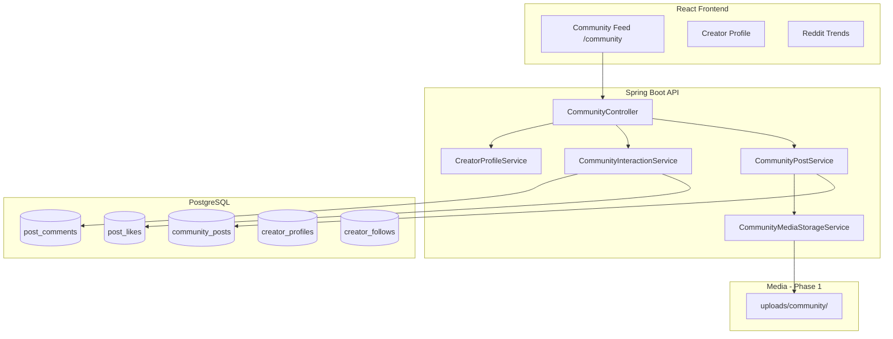

# HiVi Community Platform

HiVi is evolving from discovery-only into a **creator social ecosystem** (Behance + Reddit + Instagram + marketplace), focused on video editors and creators.

## Architecture overview



## Database relationships

| Table | Purpose | Key relations |
|-------|---------|---------------|
| `users` | Auth identity (existing) | 1:1 `creator_profiles` |
| `creator_profiles` | Bio, niche, tools, availability, stats | `user_id` → `users` |
| `community_posts` | Text/image/video/portfolio posts | `author_id` → `users` |
| `post_comments` | Comments + replies | `post_id`, `parent_id` (self), `author_id` |
| `post_likes` | Unique like per user/post | `user_id`, `post_id` |
| `post_bookmarks` | Saved posts | `user_id`, `post_id` |
| `creator_follows` | Follow graph | `follower_id`, `following_id` → `users` |

**Note:** Legacy `Post` entity (`/posts`) remains for backward compatibility. New social features use `community_posts`.

## API flow

### Read feed (public)

```
GET /api/community/feed?mode=trending&page=0&size=15
→ CommunityPostService.getFeed()
→ Ranked by trendingScore (cached: community-feed)
→ Returns: posts, featuredPost, topLikedPosts, trendingCreators
```

### Create post (authenticated)

```
POST /api/community/posts (multipart)
→ JWT required
→ CommunityMediaStorageService.store() → /api/community/media/{userId}/{file}
→ Saves CommunityPost, updates creator_profiles.totalPosts
→ Cache evict community-feed
```

### Interactions (authenticated)

| Action | Endpoint |
|--------|----------|
| Like / unlike | `POST /api/community/posts/{id}/like` |
| Bookmark | `POST /api/community/posts/{id}/bookmark` |
| Comment | `POST /api/community/posts/{id}/comments` |
| Follow | `POST /api/community/users/{id}/follow` |
| Profile | `GET /api/community/profiles/{username}` |

## Feed ranking strategy

`CommunityFeedRanker.computeScore()`:

```
score = (likes × 3) + (comments × 5) + (views × 0.05)
      + log10(likes+1) × 20
      + recency boost (150 / (hours + 2))
      + portfolio (+25) / video (+15) bonuses
```

- **Trending feed:** all published posts, sorted by score
- **Following feed:** posts from `creator_follows` only
- **Featured:** highest-scored post on page 0
- **Top liked:** separate query by `likeCount`

Scores refresh on like/comment/view; optional batch `refreshTrendingScores()` for cron.

## Media storage strategy

### Phase 1 (current — local dev / Render disk)

- Upload dir: `uploads/community/{userId}/{uuid}.ext`
- Served via `GET /api/community/media/{userId}/{filename}`
- Max upload: 50MB (`application.properties`)

### Phase 2 (production — recommended)

- **Cloudflare R2** or **AWS S3** presigned uploads
- CDN for delivery
- FFmpeg worker for video thumbnails + compression
- Separate `media_metadata` table for width/height/duration

## Scalability considerations

| Area | Current | Future |
|------|---------|--------|
| Feed query | JPA pagination + in-memory cache | Redis feed cache, cursor pagination |
| Media | Local filesystem | Object storage + CDN |
| Trending | Recomputed on write | Background job + materialized view |
| Notifications | None | WebSocket / push on like, comment, follow |
| Search | None | Elasticsearch on title, tags, niche |

## Frontend routes

| Route | Page |
|-------|------|
| `/community` | Community Feed |
| `/community/creator/:username` | Creator portfolio profile |
| `/reddit-trends` | Reddit inspiration (existing) |

Sidebar: **Community Feed** (purple) + **Trends from Reddit** (orange) above Overview.

## Auth

- **Browse feed:** public (no JWT)
- **Create, like, comment, follow:** `Authorization: Bearer {token}` from OAuth or `/auth/signin`
- Frontend: `getAuthHeaders()` in `utils/auth.js`

## Future improvements

1. Cloud media pipeline (S3/R2 + transcoding)
2. Real-time notifications
3. Direct messages between clients and editors
4. Draft autosave + scheduled posts
5. Hashtag search and explore page
6. Moderation (report, block, admin review)
7. Merge legacy `/posts` into `community_posts`
8. Editor marketplace gigs linked from community posts

## Demo / seed data (local only)

Enable in `application-local.properties`:

```properties
community.demo.seed=true
# community.demo.seed.force=true   # wipe & re-seed on startup
```

Creates **6 creator personas** with posts, likes, comments, and follows.  
Demo login: `cinematic_maya` / `demo1234` (and other `*_demo` users).

All seed users use emails `*@demo.hivi.local` — clearly not production data.

## Local development

```bash
# Backend
cd backend
export SPRING_PROFILES_ACTIVE=local
./mvnw spring-boot:run

# Frontend
cd frontend
npm start
```

Open http://localhost:3000/community — sign in via OAuth or `/auth/signin` to create posts.
