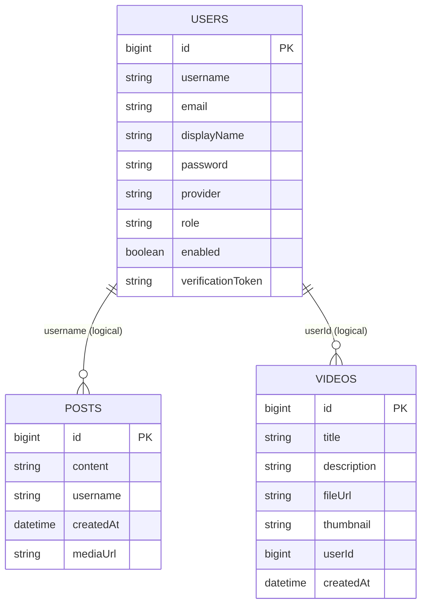

# Database Schema

**Database:** PostgreSQL  
**ORM:** Hibernate/JPA  
**DDL:** `update` (local), `validate` (production)

---

## Entity relationship overview



**Note:** There are **no JPA `@ManyToOne` relationships** today — links are loose string/Long references. This simplifies early development but lacks referential integrity.

---

## Table: `users`

**Entity:** `com.oauth.demo.entity.User`  
**Repository:** `UserRepository`

| Column | Type | Purpose |
|--------|------|---------|
| `id` | BIGINT PK | Auto-increment |
| `username` | VARCHAR | Login identifier (often email) |
| `email` | VARCHAR | Contact / OAuth email |
| `displayName` | VARCHAR | Shown name |
| `password` | VARCHAR | BCrypt hash, or `{noop}` for OAuth-only |
| `provider` | VARCHAR | `LOCAL`, `GOOGLE`, `GITHUB` |
| `role` | VARCHAR | e.g. `client`, `editor` |
| `enabled` | BOOLEAN | Account active (default false until verify) |
| `verificationToken` | VARCHAR | Email verification (optional) |

### Why it exists

Central identity for JWT subject, OAuth account linking, and future RBAC.

### OAuth user creation

`OAuth2LoginSuccessHandler` creates row with `enabled=true`, `password={noop}`, provider `GOOGLE` or `GITHUB`.

---

## Table: `post` (default JPA table name)

**Entity:** `com.oauth.demo.entity.Post`  
**Repository:** `PostRepository`

| Column | Type | Purpose |
|--------|------|---------|
| `id` | BIGINT PK | Post ID |
| `content` | VARCHAR | Text content |
| `username` | VARCHAR | Author username (not FK) |
| `createdAt` | TIMESTAMP | Sorting / feed order |
| `mediaUrl` | VARCHAR | Original filename if upload attached |

### Why it exists

Social/content posts for feed experiments. Distinct from **editor marketplace** UI on frontend.

### Index recommendation (future)

```sql
CREATE INDEX idx_posts_created_at ON post(created_at DESC);
CREATE INDEX idx_posts_username ON post(username);
```

---

## Table: `videos`

**Entity:** `com.oauth.demo.entity.Video`  
**Repository:** `VideoRepository`

| Column | Type | Purpose |
|--------|------|---------|
| `id` | BIGINT PK | Video ID |
| `title` | VARCHAR | Title |
| `description` | VARCHAR | Description |
| `fileUrl` | VARCHAR | Storage path/URL |
| `thumbnail` | VARCHAR | Thumbnail URL |
| `userId` | BIGINT | Owner (logical FK to users.id) |
| `createdAt` | TIMESTAMP | Auto-set on persist |

### Why it exists

Portfolio/reel uploads for editors (backend scaffold; storage integration TBD).

---

## Reddit data

**Not stored in PostgreSQL.** Reddit posts live in **application cache** only (`reddit-trending`). Refreshed from external API on schedule.

---

## Connection configuration

| Environment | Source |
|-------------|--------|
| **Render** | `DATABASE_URL` (Internal URL) |
| **Local** | `application-local.properties` or env |

Parsed by `DatabaseConfig` + `DatabaseUrlParser`.

---

## Developer understanding

### Why no foreign keys?

Faster MVP; avoids migration pain when iterating. **Production scale:** add `@ManyToOne User author` on `Post` with `ON DELETE` rules.

### Scalability suggestions

| Improvement | Benefit |
|-------------|---------|
| `users.email` UNIQUE index | Prevent duplicate OAuth accounts |
| `projects` table | Replace mock projects in localStorage |
| `editor_profiles` table | Match `PostCard` UI model |
| `oauth_accounts` table | Link multiple providers to one user |
| Flyway/Liquibase migrations | Safe prod schema changes (replace `ddl-auto=update`) |

### Alternatives

| Approach | When |
|----------|------|
| MongoDB for posts feed | High write volume, flexible schema |
| Read replicas | Heavy read traffic on feed |
| Separate auth DB | Large multi-service split |

### JPA ddl-auto strategy

| Profile | Setting | Meaning |
|---------|---------|---------|
| Local | `update` | Auto-alter tables (dev friendly) |
| Prod | `validate` | Fail deploy if schema mismatch — **safer** |
