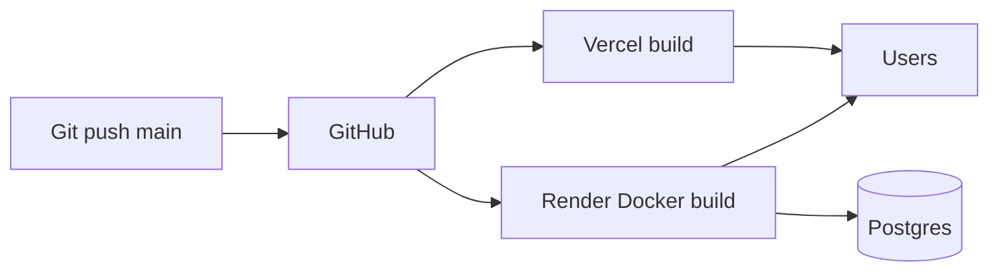

# Deployment Guide

## Overview

| Component | Platform | URL |
|-----------|----------|-----|
| **Frontend** | Vercel | https://hi-vi.vercel.app |
| **Backend** | Render (Docker) | https://hivi-idam.onrender.com |
| **PostgreSQL** | Render managed | Internal `DATABASE_URL` |
| **Redis** | Local dev only | Not used in prod profile |

---

## Deployment flow



There is **no custom CI pipeline** in-repo — Vercel and Render auto-deploy from connected Git branches (typically `main`).

---

## Frontend — Vercel

### Setup

1. Import GitHub repo in Vercel
2. **Root Directory:** `frontend`
3. **Build Command:** `npm run build`
4. **Output:** `build`

### Environment variables

| Key | Value |
|-----|--------|
| `REACT_APP_API_URL` | `https://hivi-idam.onrender.com` |

Rebuild required after changing env vars.

### SPA routing

`frontend/vercel.json`:

```json
{ "rewrites": [{ "source": "/(.*)", "destination": "/index.html" }] }
```

Ensures `/dashboard`, `/oauth-success`, etc. work on refresh.

### CI behavior

Vercel runs `npm run build` with `CI=true` — ESLint warnings fail build. Fix lint before push.

---

## Backend — Render

### Setup

1. **New → Web Service** → connect repo
2. **Root Directory:** `backend`
3. **Runtime:** Docker (`Dockerfile`)
4. **Health Check Path:** `/health`

### Docker build

`backend/Dockerfile`:

- Stage 1: JDK 17 — `./mvnw package -DskipTests`
- Stage 2: JRE 17 — run jar with `-Dserver.port=${PORT}` and `SPRING_PROFILES_ACTIVE=prod`

### Environment variables (required)

| Key | Value |
|-----|--------|
| `SPRING_PROFILES_ACTIVE` | `prod` |
| `DATABASE_URL` | From Render Postgres (Internal URL) |
| `APP_FRONTEND_URL` | `https://hi-vi.vercel.app` |
| `JWT_SECRET` | Long random string |
| `GOOGLE_CLIENT_ID` | Google Console |
| `GOOGLE_CLIENT_SECRET` | Google Console |
| `GITHUB_CLIENT_ID` | GitHub OAuth App |
| `GITHUB_CLIENT_SECRET` | GitHub OAuth App (**required**) |

`PORT` and `RENDER_EXTERNAL_URL` are set automatically by Render.

### render.yaml (optional blueprint)

`backend/render.yaml` documents expected services and env var names for Infrastructure-as-Code style setup.

### Postgres / schema

Production uses `spring.jpa.hibernate.ddl-auto=update` so new tables (e.g. `community_posts`, `opportunities`) are created on deploy. If you switch to `validate`, run migrations first or the app will fail with `Schema validation: missing table [...]`.

1. Create Render PostgreSQL instance
2. Link to web service → injects `DATABASE_URL`
3. Prod uses `ddl-auto=validate` — schema must already exist from earlier deploys

### Redis on Render

**Not enabled in production profile.** Cache uses in-memory `ConcurrentMapCacheManager`. Email `/auth/verify` returns error without Redis.

To add Redis later: Render Redis add-on + remove Redis exclusions from `application-prod.properties`.

---

## OAuth production configuration

### Google Cloud Console

- **Authorized redirect URI:**  
  `https://hivi-idam.onrender.com/login/oauth2/code/google`

### GitHub OAuth App

- **Homepage URL:** `https://hi-vi.vercel.app`
- **Authorization callback URL:**  
  `https://hivi-idam.onrender.com/login/oauth2/code/github`

### Verify after deploy

```text
GET https://hivi-idam.onrender.com/oauth/status
```

Expect: `githubClientSecretSet: true`, `readyForGithubLogin: true`, `issues: []`

---

## Local development

### Backend

```bash
cd backend
# Start Postgres + Redis (docker-compose if available)
export DATABASE_URL=postgresql://...
export SPRING_PROFILES_ACTIVE=local  # optional
./mvnw spring-boot:run
```

### Frontend

```bash
cd frontend
echo "REACT_APP_API_URL=http://localhost:8080" > .env.local
npm start
```

---

## CI/CD flow (current)

| Stage | What runs |
|-------|-----------|
| Push to `main` | Triggers Vercel + Render hooks |
| Vercel | `npm ci` + `npm run build` (ESLint strict in CI) |
| Render | Docker multi-stage build + Maven compile |
| Tests | `mvn test` not enforced in Dockerfile (`-DskipTests`) |

**Recommendation:** Add GitHub Actions for `mvn test` + `npm test` before deploy.

---

## Troubleshooting

| Symptom | Fix |
|---------|-----|
| Render build fails (Java compile) | Check Maven errors; missing symbols |
| Port scan timeout | Set health check `/health`; reduce startup time (`lazy-initialization`) |
| `localhost:5432` | Set `DATABASE_URL`, `SPRING_PROFILES_ACTIVE=prod` |
| OAuth `invalid_client` | Set `GITHUB_CLIENT_SECRET` on Render |
| Frontend calls wrong API | Set `REACT_APP_API_URL` on Vercel |
| Reddit empty | Wait 5 min for scheduler; check logs for Reddit fetch |

---

## Developer understanding

### Why Docker on Render?

Reproducible JDK 17 build; matches local Maven wrapper version.

### Why separate Vercel + Render?

Static frontend is free and global CDN; JVM backend needs long-running process and Postgres proximity.

### Cold starts (free tier)

Render spins down after inactivity. First request slow; `wakeBackend.js` mitigates before OAuth.

### Production best practices

- Use Internal `DATABASE_URL` on Render (not External) for lower latency
- Never commit `.env` files
- Rotate secrets if leaked
- Monitor `/health` and `/oauth/status` after each deploy
