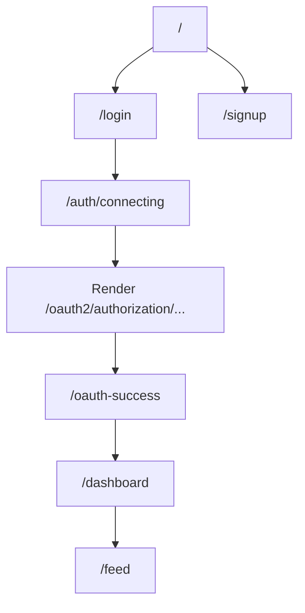
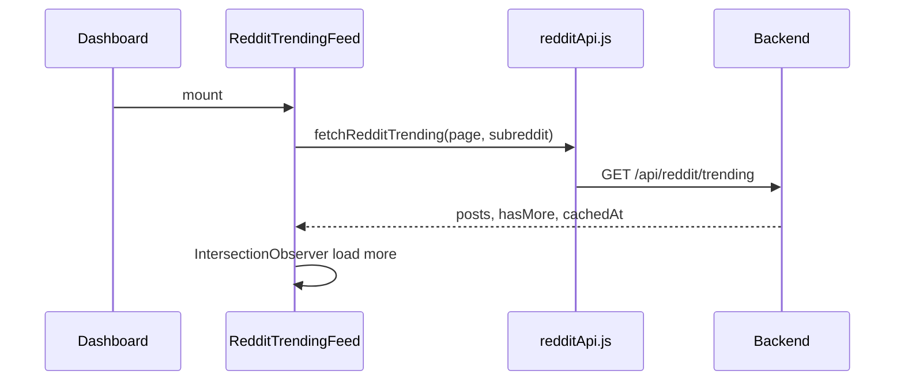

# Frontend Flow

**Stack:** React 19, React Router 7, Create React App  
**Root:** `frontend/src/index.js` → `App.js`

---

## Application structure

```text
src/
├── App.js              # Router definition
├── App.css             # Global design tokens (:root variables)
├── index.js            # ReactDOM entry
├── pages/              # Route-level screens
├── components/         # Reusable UI
│   └── reddit/         # Reddit trending feed
├── services/           # API clients
└── utils/              # auth, oauth, wakeBackend
```

---

## Routing

| Path | Component | Auth expectation |
|------|-----------|------------------|
| `/` | `Home` | Public marketing |
| `/login` | `Login` | Public |
| `/signup` | `Signup` | Public |
| `/auth/connecting` | `AuthConnecting` | Pre-OAuth loading |
| `/oauth-success` | `OAuthSuccess` | OAuth callback landing |
| `/dashboard` | `Dashboard` | Intended post-login (no route guard) |
| `/feed` | `HomeFeed` | Editor discovery (mock data) |

**Note:** There is **no `ProtectedRoute` wrapper** today. `/dashboard` is reachable without login; user defaults to "Guest".



---

## Component hierarchy

### Dashboard (post-login hub)

```text
Dashboard
├── Navbar
├── Sidebar (tabs: overview, projects, messages, earnings, profile)
└── Main
    ├── Greeting + stats (mock)
    ├── RedditTrendingFeed      ← real API
    ├── Recent projects (mock / localStorage)
    └── Quick actions
```

### HomeFeed (editor marketplace UI)

```text
HomeFeed
├── Navbar
├── PostBox (search / filter / sort — not “create post”)
└── Feed
    └── PostCard × N (mock editor profiles)
```

### Auth screens

```text
Login / Signup
├── Auth left panel (brand, testimonial)
├── OAuthErrorCard
├── Email/password form
└── Google + GitHub buttons → /auth/connecting

AuthConnecting
└── AuthLoadingScreen + wakeBackend → redirect to backend OAuth

OAuthSuccess
└── Parse URL params → localStorage → /dashboard
```

---

## State management

| Data | Storage | File |
|------|---------|------|
| User name, email, role, projects | `localStorage.hivi_user` | `utils/auth.js` |
| JWT | `localStorage.token` | `OAuthSuccess.js`, Login (partial) |
| Reddit feed | React `useState` in component | `RedditTrendingFeed.js` |
| OAuth errors | URL `?error=` | `Login.js` + `oauthErrors.js` |

**No Redux/Context global store** — intentional simplicity for MVP.

---

## API calls

| Client | Used for |
|--------|----------|
| `services/api.js` | Axios instance, `baseURL = getApiUrl()` |
| `fetch` | `/health`, `/oauth/status`, `/api/reddit/trending` |
| `services/redditApi.js` | Reddit trending endpoint |
| `utils/wakeBackend.js` | Ping `/health` before OAuth |
| `utils/oauthStatus.js` | Preflight OAuth config check |

**Base URL resolution** (`utils/auth.js`):

```javascript
REACT_APP_API_URL → else production https://hivi-idam.onrender.com → else localhost:8080
```

---

## Authentication handling (frontend)

### Email login (current behavior)

`Login.js` → validates form → **mock 500ms delay** → `saveUser()` to localStorage → `/dashboard`.

**Does not call** `POST /auth/signin` yet (backend supports it).

### OAuth login

```text
1. Click GitHub/Google
2. Optional: fetchOAuthStatus — block if secret missing
3. navigate('/auth/connecting?provider=github')
4. wakeBackend() — GET /health until 200
5. window.location = {apiUrl}/oauth2/authorization/{provider}
6. User authorizes on provider
7. Backend redirects to /oauth-success?token&name&email&role
8. Save token + user → /dashboard
```

### Sign out

`clearUser()` removes `hivi_user` and `token` → navigate `/`.

---

## Design system

Defined in `App.css` `:root`:

| Token | Usage |
|-------|--------|
| `--black`, `--surface` | Backgrounds |
| `--gold`, `--gold2` | Brand accent |
| `--font-display` | Playfair Display — headings |
| `--font-mono` | Space Mono — labels |
| `--transition` | 0.4s easing |

Reddit components add **purple neon** accents (`#a855f7`) in `reddit/*.css`.

---

## Dashboard data flow (Reddit)



---

## Developer understanding

### Why no global state library?

Few shared slices (user + token). `localStorage` + props suffice until real-time features (chat, notifications) arrive.

### Why mock editor feed but real Reddit?

Editor marketplace backend (Editor entity, matching API) not built yet. Reddit integration is read-only and was prioritized for dashboard “ecosystem” feel.

### Protected routes (recommended next step)

```jsx
// Pattern to add later
function RequireAuth({ children }) {
  const user = getUser();
  if (!user) return <Navigate to="/login" />;
  return children;
}
```

### File connection map

| User action | Files involved |
|-------------|----------------|
| Land on site | `Home.js`, `Navbar.js` |
| OAuth login | `Login.js` → `AuthConnecting.js` → `OAuthSuccess.js` |
| See Reddit trends | `/reddit-trends` → `RedditTrendsPage.js` → `RedditTrendingFeed.js` → `redditApi.js` |
| Browse editors | `HomeFeed.js` → `Feed.js` (mock) |

### Production checklist (frontend)

- Set `REACT_APP_API_URL` on Vercel
- `vercel.json` rewrites all routes to `index.html` (SPA)
