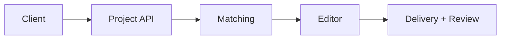

# Future Roadmap

Prioritized ideas for HiVi evolution. Not committed timelines — use for planning and Cursor context.

---

## Phase 1 — Stabilize core (near term)

| Item | Why | Suggested approach |
|------|-----|-------------------|
| Fix GitHub OAuth in prod | Blocks login | `GITHUB_CLIENT_SECRET` + docs |
| Wire email login to `/auth/signin` | Real auth path | `Login.js` + store JWT |
| React `ProtectedRoute` | Security UX | Wrap `/dashboard`, `/feed` |
| Sync user from `/user/me` | Single source of truth | Dashboard `useEffect` |
| GitHub Actions CI | Catch compile errors | `mvn test` + `npm run build` |
| Flyway migrations | Safe schema changes | Replace `ddl-auto=update` in prod |

---

## Phase 2 — Creator marketplace

| Item | Description |
|------|-------------|
| **Editor entity** | DB model matching `PostCard` props |
| **Editor profiles API** | CRUD + search + filters |
| **Wire HomeFeed** | Replace `mockEditors` with API |
| **Project posting** | Clients create projects; editors apply |
| **Messaging** | Dashboard messages tab |
| **Reviews & ratings** | After project completion |

---

## Phase 3 — Reddit & content ecosystem

| Item | Description |
|------|-------------|
| Reddit official OAuth API | Higher rate limits, reliability |
| Persist Reddit posts | Optional PG table for analytics |
| Personalization | Save subreddits per user |
| In-app preview | Embed Reddit content safely |
| Creator blog / tips | Curated editorial content |

See [REDDIT_INTEGRATION_PLAN.md](./REDDIT_INTEGRATION_PLAN.md) for current vs planned Reddit scope.

---

## Phase 4 — AI features

| Feature | Idea |
|---------|------|
| **Brief → editor match** | NLP on project brief |
| **Auto highlight reel** | Summarize editor portfolios |
| **Smart Reddit digest** | Weekly AI summary for dashboard |
| **Chat assistant** | Help clients write better briefs |
| **Quality scoring** | Assist review process |

**Architecture note:** Add `ai/` service package or external worker queue; do not block main API thread.

---

## Phase 5 — Collaboration & realtime

| Feature | Idea |
|---------|------|
| Project workspaces | Files, comments, versions |
| Realtime chat | WebSocket or Firebase |
| Notifications | Email + in-app |
| Calendar / deadlines | Sync with projects table |
| Payment escrow | Stripe integration |

---

## Phase 6 — Scale & optimization

| Area | Improvement |
|------|-------------|
| **Redis on Render** | Shared cache across instances |
| **CDN for media** | S3 + CloudFront for uploads |
| **API gateway** | Rate limiting, WAF |
| **Read replicas** | Postgres scaling |
| **Microservices split** | Auth vs content vs matching (only if needed) |
| **Next.js migration** | SSR for SEO on marketing pages |
| **Observability** | Sentry, structured logs, metrics |

---

## Technical debt to address

| Debt | Impact |
|------|--------|
| Mock dashboard data | Misleading UX |
| `Post` vs editor naming | Confusion for contributors |
| No API versioning | Breaking changes risky |
| localStorage auth | XSS exposure |
| Skip tests in Docker build | Regressions slip through |
| Inconsistent endpoint auth rules | `/posts` vs `/feed` |

---

## Reddit-specific roadmap

| Step | Status |
|------|--------|
| Public JSON + cache + scheduler | ✅ Done |
| Dashboard UI + filters + infinite scroll | ✅ Done |
| Reddit OAuth app for higher limits | Planned |
| Store historical posts in PG | Planned |
| User favorites / bookmarks | Planned |

---

## Developer understanding

### How to prioritize

Use **user-facing unblockers first** (OAuth, real login, protected routes), then **marketplace MVP** (editor API), then **differentiators** (AI, collaboration).

### Scalability path

Stay monolith until:

- >1 developer team, or
- Clear bounded contexts fighting each other, or
- Deploy times / memory limits on Render force split

### Alternatives for rapid MVP

| Need | Faster option |
|------|----------------|
| Payments | Stripe Checkout |
| Chat | Stream, Sendbird |
| Auth | Clerk, Auth0 |
| File storage | Uploadthing, S3 presigned URLs |

Document choice in ARCHITECTURE.md when adopted.
