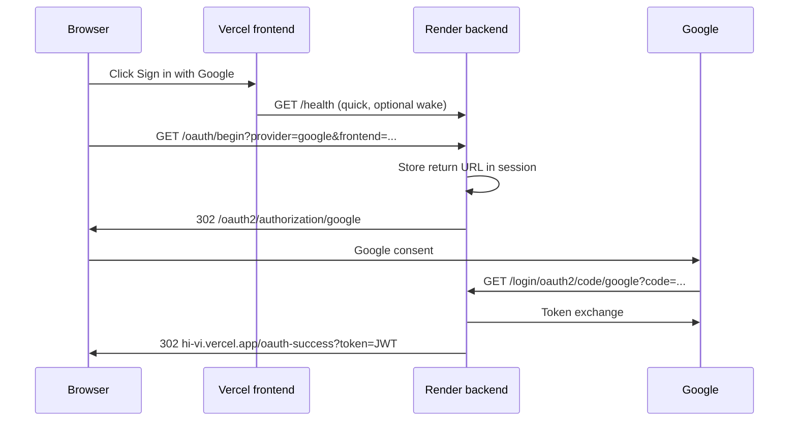

# HiVi OAuth flow (Google / GitHub)

## How sign-in works

## Common issues

### Slow login (minutes on loading screen)

**Cause:** Render free tier **cold start** + frontend previously waited up to **90 seconds** on `/auth/connecting` before redirecting to Google.

**Mitigations implemented:**

- Warm backend: max **12s** wake, then redirect anyway
- If `/health` responds in **2s**, skip loading page and go straight to `/oauth/begin`
- **Skip** button after 6s on loading screen
- Production: `spring.main.lazy-initialization=false` so OAuth beans load at startup
- `OAuthStartupWarmup` logs exact `redirect_uri` at boot

### Google `redirect_uri_mismatch` (Error 400)

**Cause:** The URL Spring sends to Google (`{app.base.url}/login/oauth2/code/google`) is **not** listed on the **same** OAuth client as `GOOGLE_CLIENT_ID` on Render.

**Fix:**

1. Open https://hivi-idam.onrender.com/oauth/status
2. Copy `googleRedirectUri` (or `googleRegistration.redirectUri`)
3. Google Cloud Console → APIs & Services → Credentials → OAuth 2.0 Client IDs → open client matching `googleClientIdPrefix`
4. **Authorized redirect URIs** → add exactly:
   - `https://hivi-idam.onrender.com/login/oauth2/code/google`
   - `http://localhost:8080/login/oauth2/code/google` (local dev)
5. **Authorized JavaScript origins** (optional): `https://hi-vi.vercel.app`, `http://localhost:3000`
6. On Render set `APP_BASE_URL=https://hivi-idam.onrender.com` (no trailing slash)
7. Redeploy backend

### Session expired during OAuth

**Cause:** Cold start took so long that the OAuth `state` cookie/session expired before callback.

**Fix:** Faster wake + retry sign-in; complete Google consent in one tab without long delays.

## Environment variables (Render)

| Variable | Example |
|----------|---------|
| `APP_BASE_URL` | `https://hivi-idam.onrender.com` |
| `APP_FRONTEND_URL` | `https://hi-vi.vercel.app` |
| `GOOGLE_CLIENT_ID` | `....apps.googleusercontent.com` |
| `GOOGLE_CLIENT_SECRET` | from same Google client |
| `JWT_SECRET` | 32+ random characters |

## Frontend env (Vercel)

| Variable | Value |
|----------|--------|
| `REACT_APP_API_URL` | `https://hivi-idam.onrender.com` |

Optional: `REACT_APP_OAUTH_API_URL` if OAuth backend differs from API URL.
