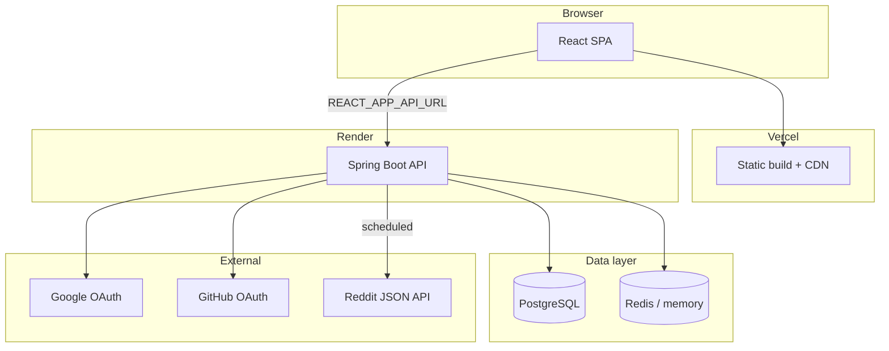

# HiVi — Project Overview

## What is HiVi?

**HiVi** is a creator-focused platform that connects **clients** (brands, creators, filmmakers) with **professional video editors**. The product vision is a premium, cinematic marketplace: discover editors, manage projects, and stay inspired by industry trends.

**Live demo:** https://hi-vi.vercel.app  
**Backend API:** https://hivi-idam.onrender.com

---

## Main purpose

| Audience | Value |
|----------|--------|
| **Clients** | Find and hire editors, track projects, manage spend |
| **Editors** | Showcase skills, get discovered, receive work |
| **Platform** | Secure auth, content feed, future collaboration tools |

---

## Main features (current)

| Feature | Status | Where |
|---------|--------|--------|
| Marketing homepage | ✅ Live | `frontend/src/pages/Home.js` |
| Email/password signup & signin (API) | ✅ Backend | `AuthController` |
| Google & GitHub OAuth | ✅ Backend + partial UI | `SecurityConfig`, `Login.js` |
| JWT authentication | ✅ Backend | `JwtUtils`, `AuthTokenFilter` |
| User dashboard (overview) | ✅ UI (mock data) | `Dashboard.js` |
| Editor discovery feed | ✅ UI (mock editors) | `HomeFeed.js`, `Feed.js` |
| **Trending from Reddit** | ✅ Live | `reddit/*`, `RedditTrendingFeed.js` |
| Social posts API | ✅ Backend | `PostController`, `Post` entity |
| OAuth diagnostics | ✅ Live | `/oauth/status` |
| Email verification (Redis) | ⚠️ Dev only | `AuthController` `/auth/verify` |

---

## Tech stack summary

| Layer | Technology | Why |
|-------|------------|-----|
| **Frontend** | React 19, React Router 7, CRA | SPA, familiar ecosystem, Vercel deploy |
| **HTTP client** | Axios (`services/api.js`) + `fetch` for some calls | Simple API layer |
| **Backend** | Spring Boot 4, Java 17 | Security, JPA, OAuth2, scheduling |
| **Security** | Spring Security 6, JWT (jjwt), OAuth2 Client | Industry standard for Java auth |
| **Database** | PostgreSQL (JPA/Hibernate) | Relational user/post/video data |
| **Cache** | Redis (local) / in-memory (prod) | Posts cache, Reddit feed, verify codes |
| **Deploy** | Vercel + Render + Docker | Free tier friendly |

---

## Overall system design



---

## Repository layout

```text
HiVi/
├── backend/          # Spring Boot API
├── frontend/         # React app
├── docs/             # This documentation system
└── README.md         # GitHub readme
```

---

## Developer understanding

### Why this stack?

- **Monorepo** keeps frontend and backend in sync for a small team / solo dev.
- **Spring Boot** gives OAuth2, JWT, JPA, and scheduling out of the box.
- **Render + Vercel** avoids managing servers; fits student/MVP budgets.

### Alternatives considered (implicitly)

| Area | Alternative | Why not (yet) |
|------|-------------|----------------|
| Auth | Auth0 / Clerk | Cost + learning curve; custom OAuth teaches flow |
| Frontend | Next.js | CRA already in place; migration possible later |
| DB | MongoDB | Users/posts are relational; JPA fits |
| Reddit | Official Reddit API with OAuth | Public JSON + cache is simpler for read-only hot posts |

### Scalability notes

- Stateless API + JWT → horizontal scaling on Render paid tiers.
- Reddit feed already decoupled via cache (no per-user Reddit calls).
- Split into microservices only when team/traffic justifies ops cost.

### Production best practices in use

- `prod` profile with `ddl-auto=validate`
- Health endpoint for Render
- Secrets via environment variables (never committed)
- CORS restricted to known frontend origins
- OAuth redirect URIs tied to `RENDER_EXTERNAL_URL`
