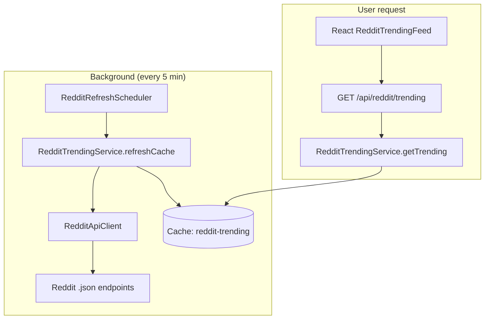

# Reddit Integration — Plan & Implementation Status

> **Note:** This feature is **implemented**. This document serves as the plan, architecture reference, and maintenance guide. Technical details also live in `backend/REDDIT.md`.

---

## Goal

Turn the HiVi dashboard into a **live creator ecosystem** by surfacing trending posts from video-editing subreddits — without hammering Reddit’s API on every page view.

---

## Subreddits (configured)

| Subreddit | Focus |
|-----------|--------|
| r/videoediting | General editing |
| r/editors | Professional editors |
| r/AfterEffects | Motion/VFX |
| r/premiere | Adobe Premiere |
| r/videography | Production |
| r/Filmmakers | Filmmaking |

Configure via `reddit.subreddits` in `application.properties`.

---

## Implementation status

| Requirement | Status | Location |
|-------------|--------|----------|
| Fetch hot posts from Reddit | ✅ | `RedditApiClient.java` |
| Clean service architecture | ✅ | `reddit/service/`, `reddit/cache/` |
| DTOs for posts | ✅ | `RedditPostDto.java` |
| `GET /api/reddit/trending` | ✅ | `RedditController.java` |
| Redis / cache layer | ✅ | `RedditCacheService`, `CacheConfig` |
| Scheduled refresh (~5 min) | ✅ | `RedditRefreshScheduler.java` |
| Graceful API failures | ✅ | Stale cache + exception handler |
| Logging | ✅ | SLF4J in client/service |
| Dashboard UI section | ✅ | `RedditTrendingFeed.js` |
| Subreddit filter tabs | ✅ | Frontend tabs |
| Infinite scroll | ✅ | IntersectionObserver |
| Open on Reddit | ✅ | `RedditPostCard` button |
| Loading skeletons | ✅ | `RedditTrendingFeed` |
| Purple neon UI | ✅ | `reddit/*.css` |

---

## Architecture



**Key rule:** User traffic **never** calls Reddit directly — only reads cache.

---

## API contract

### `GET /api/reddit/trending`

| Query | Description |
|-------|-------------|
| `subreddit` | Optional filter (`videoediting` or `all`) |
| `page` | Zero-based page |
| `limit` | Page size (max 50) |

### Post card fields (frontend)

| Field | Source |
|-------|--------|
| title | Reddit `title` |
| subreddit | `r/{name}` |
| upvotes | `score` |
| commentCount | `num_comments` |
| author | `author` |
| thumbnailUrl | `thumbnail` or `preview` |
| timeAgo | Computed from `created_utc` |
| redditUrl | `https://www.reddit.com` + `permalink` |

---

## Caching strategy

| Layer | Behavior |
|-------|----------|
| **Refresh** | Startup warm + `fixedDelay` 300000 ms |
| **Storage** | `reddit-trending` cache key `all` |
| **Local dev** | Redis with 10 min TTL (if `spring.cache.type=redis`) |
| **Production** | In-memory `ConcurrentMapCacheManager` |
| **Fallback** | `AtomicReference` in `RedditCacheService` |
| **Stale serve** | If refresh fails, old cache still returned |

---

## Rate limit handling

| Constraint | Mitigation |
|------------|------------|
| ~10 req/min unauthenticated | Only ~6 requests per refresh, 1.1s apart |
| Refresh every 5 min | ~1.2 requests/min average |
| User API | Zero Reddit calls |
| HTTP 429 | `RedditFetchException`; log + keep stale cache |

**Future:** Register Reddit OAuth app for 60 req/min if needed.

---

## Folder map

```text
backend/.../reddit/
├── config/RedditProperties.java
├── config/RedditClientConfig.java
├── controller/RedditController.java
├── service/RedditApiClient.java
├── service/RedditTrendingService.java
├── cache/RedditCacheService.java
├── scheduler/RedditRefreshScheduler.java
├── dto/
└── exception/

frontend/src/
├── services/redditApi.js
└── components/reddit/
    ├── RedditTrendingFeed.js
    └── RedditPostCard.js
```

---

## Developer understanding

### Why public JSON instead of OAuth API?

- No client secret to manage for read-only hot posts  
- Sufficient for MVP dashboard widget  
- Cache makes rate limits manageable  

### Why not store in PostgreSQL?

- Reddit data is ephemeral; cache is enough for “trending now”  
- Avoids DB bloat and sync complexity  
- Optional future: archive table for analytics  

### Production best practices

- Set descriptive `reddit.user-agent` (required by Reddit rules)  
- Monitor logs for `Reddit refresh failed`  
- Do not decrease `request-delay-ms` below ~1000ms without OAuth credentials  
- After deploy, wait one refresh cycle before expecting full feed  

### Alternatives

| Option | Tradeoff |
|--------|----------|
| RSS feeds | Less metadata, no scores |
| Third-party aggregators | Cost, dependency |
| Manual curation | Editorial quality, not scalable |

---

## Testing checklist

- [ ] `GET /api/reddit/trending` returns posts after startup  
- [ ] `cachedAt` updates every ~5 minutes  
- [ ] Subreddit filter returns subset  
- [ ] `hasMore` pagination works in UI  
- [ ] Thumbnail fallback when image fails  
- [ ] Reddit link opens in new tab  

---

## Related docs

- [API_REFERENCE.md](./API_REFERENCE.md) — endpoint details  
- [ARCHITECTURE.md](./ARCHITECTURE.md) — caching in system context  
- [FUTURE_ROADMAP.md](./FUTURE_ROADMAP.md) — Reddit phase 3 enhancements  
